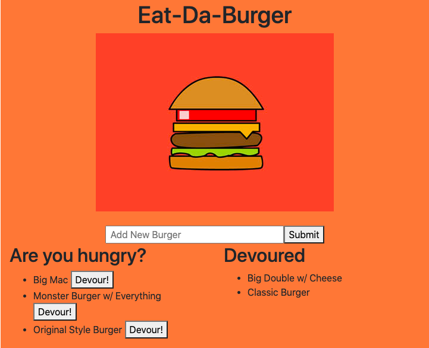

# Burger App
* The Burger App is an application that uses MySQL, Handlebars, Express, and Javascript to devour any kind burger that the user desires virtually.

# Table of Contents

* [Description](#description)
* [Links](#links)
* [Purpose](#purpose)
* [Contributors](#contributors)
* [Contact](#contact)
* [Credits](#credits)

# **Description**
* The Burger App has an input section where the user can write-in any burger that they desire and submit it onto the web appplication. After the user submits their burger, it is stored in a database and appears on the page. The user then has the option to eat the burger if they would like to and it would apre on the Devoured column on the page. 

* Screenshot of Deployed Application:

# **Links**
* Deployed Heroku: https://floating-depths-34848.herokuapp.com/
* Github Overview: https://github.com/iariyami/burger-app

# **Purpose**
* The purpose of this is to get practice using handlebars and for the user to enjoy a fun application.

# **Contributors**
* Ibrahim Riyami

# **Contact**
* https://github.com/iariyami

* iariyami@ncsu.edu

# **Credits**
* Carl(BCS)

* nodejs.org

* https://www.npmjs.com/package/inquirer#question

* mySQL